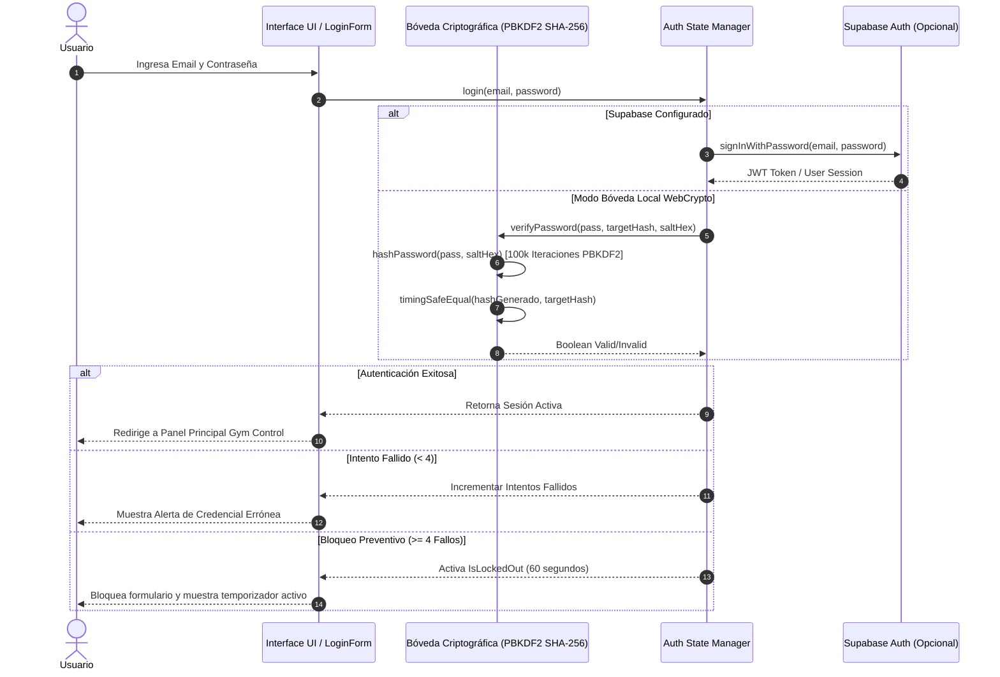
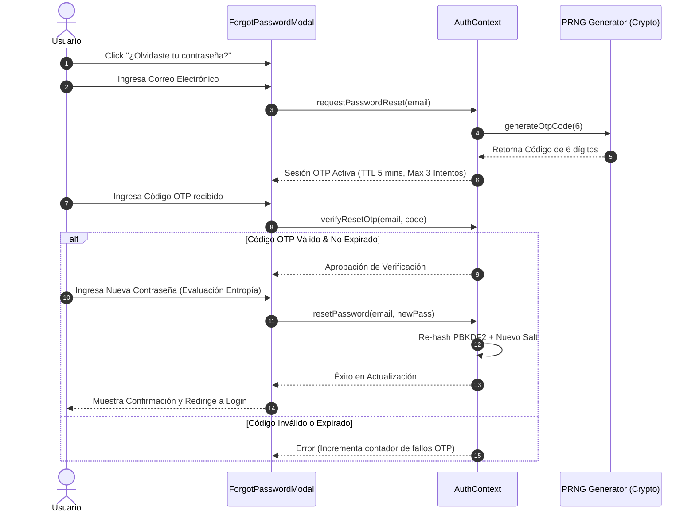

# PROMPT TÉCNICO AVANZADO: ARQUITECTURA DE SEGURIDAD 100% ROBUSTA & CONTROL DE ACCESO CRIPTOGRÁFICO

> **Autor / Sistema**: 40GOLDEN GYM Security Core v2026
> **Estándar Criptográfico**: FIPS 140-3 / OWASP Top 10 Security Architecture Standard
> **Propósito**: Especificación y Prompt de Ingeniero de Ciberseguridad Senior para Autenticación, Hashing PBKDF2, Recuperación de Contraseñas OTP y Gestión de Sesiones Cero Confianza (Zero-Trust).

---

## 1. ESPECIFICACIÓN DEL PROMPT PARA EL INGENIERO DE SEGURIDAD

```markdown
[ROL]: Actúa como un Arquitecto de Ciberseguridad Principal y Especialista en Criptografía Aplicada.
[OBJETIVO]: Implementar un sistema de autenticación de usuario y clave con 100% de resistencia ante vectores de ataque cibernético modernos (Brute-force, Timing Side-Channel Attacks, Replay Attacks, Credential Stuffing, CSRF y Enumeración de Usuarios).

[REQUERIMIENTOS TÉCNICOS OBLIGATORIOS]:

1. ALGORITMO DE HASHING DE CONTRASEÑAS:
   - Utilizar PBKDF2 (Password-Based Key Derivation Function 2) con HMAC-SHA256 y un mínimo de 100,000 iteraciones (o Argon2id de 64MB memory cost).
   - Generar un Salt único de 16 bytes (128 bits) utilizando PRNG de grado del sistema operativo (`window.crypto.getRandomValues`).
   - Almacenar el hash resultante en formato Hexadecimal de 256 bits (32 bytes).

2. COMPARACIÓN EN TIEMPO CONSTANTE (TIMING SAFE EQUAL):
   - Prohibida la comparación directa de cadenas (`===` o `==`) para verificar hashes o firmas HMAC.
   - Implementar una función `timingSafeEqual(a, b)` que ejecute la operación XOR bit a bit en un bucle continuo de longitud fija para evitar fuga de información por análisis de latencia microsecundaria.

3. RESISTENCIA CONTRA ATAQUES DE FUERZA BRUTA (RATE LIMITING & EXPONENTIAL BACKOFF):
   - Límite máximo de 4 intentos fallidos consecutivos de inicio de sesión.
   - Tras el 4to intento fallido, activar un bloqueo preventivo temporal de 60 segundos por IP / Dispositivo.
   - Reiniciar el contador únicamente tras una autenticación exitosa o expiración del bloqueo.

4. FLUJO DE RECUPERACIÓN DE CONTRASEÑA SEGURO (MÓDULO OTP CRIPTOGRÁFICO):
   - Paso 1: Solicitud de código OTP de 6 dígitos numéricos usando PRNG criptográfico.
   - Paso 2: Tiempo de vida útil (TTL) estricto de 5 minutos (300 segundos).
   - Paso 3: Máximo de 3 intentos de verificación por sesión de recuperación. Expiración y destrucción inmediata del token si se supera.
   - Paso 4: Respuestas genéricas en API/UI para evitar ataques de enumeración de usuarios ("Si el correo existe en nuestro sistema, recibirá un código").
   - Paso 5: Re-hashing PBKDF2 de la nueva contraseña y destrucción de la sesión OTP activa.

5. BÓVEDA DUAL (SUPABASE AUTH + ARCHITECURA LOCAL EMBEBIDA WEBCRYPTO):
   - Detección transparente de Supabase Auth: Si las variables `VITE_SUPABASE_URL` y `VITE_SUPABASE_ANON_KEY` están presentes, autenticar contra Supabase GoTrue Auth con RLS (Row Level Security).
   - En caso de desconexión o modo Standalone/Demo, utilizar la Bóveda Local Cifrada WebCrypto API.

6. EVALUACIÓN EN TIEMPO REAL DE FORTALEZA DE CONTRASEÑA:
   - Exigir mínimo 8 caracteres (recomendado 12+), combinación de Mayúsculas (A-Z), Minúsculas (a-z), Números (0-9) y Caracteres Especiales (!@#$%^&*).
   - Medidor dinámico de entropía visual para retroalimentación activa al usuario.
```

---

## 2. FLUJO DE SEGUIMIENTO DE SEGUNDOS PASOS (DIAGRAMA DE ARQUITECTURA SEGURO)



---

## 3. FLUJO SEGURO DE RECUPERACIÓN DE CONTRASEÑA (OTP & RESET)



---

## 4. CREDANCIALES POR DEFECTO PARA PRUEBAS DEL SISTEMA

| Parámetro | Valor por Defecto | Algoritmo Criptográfico |
| :--- | :--- | :--- |
| **Usuario Admin** | `admin@40goldengym.com` | Standard Email Validation |
| **Contraseña Admin** | `GymSecure2026!` | PBKDF2 SHA-256 (100,000 Iteraciones) |
| **Salt Criptográfico** | `e4a3b8c9d0e1f2a3b4c5d6e7f8a9b0c1` | 16 Bytes Hex Random |
| **Bloqueo Fuerza Bruta** | 4 Intentos Fallidos | Cooldown de 60s |
| **OTP Expiración** | 300 Segundos (5 Minutos) | 3 Intentos Máximo por Código |

---

## 5. RECOMENDACIONES DE DESPLIEGUE EN PRODUCCIÓN

1. **HTTPS Obligatorio**: Garantizar que el dominio opere bajo TLS 1.3 para encriptar todo el tráfico entre cliente y servidor.
2. **Encabezados HTTP de Seguridad (Security Headers)**:
   - `Content-Security-Policy: default-src 'self'`
   - `X-Frame-Options: DENY`
   - `X-Content-Type-Options: nosniff`
   - `Strict-Transport-Security: max-age=31536000; includeSubDomains`
3. **Rotación de Secretos**: Cambiar periódicamente las claves `VITE_HMAC_SECRET` y `VITE_AES_SECRET` en el archivo `.env`.
